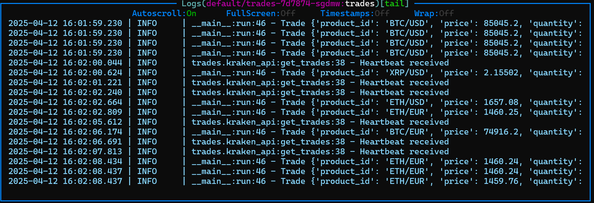
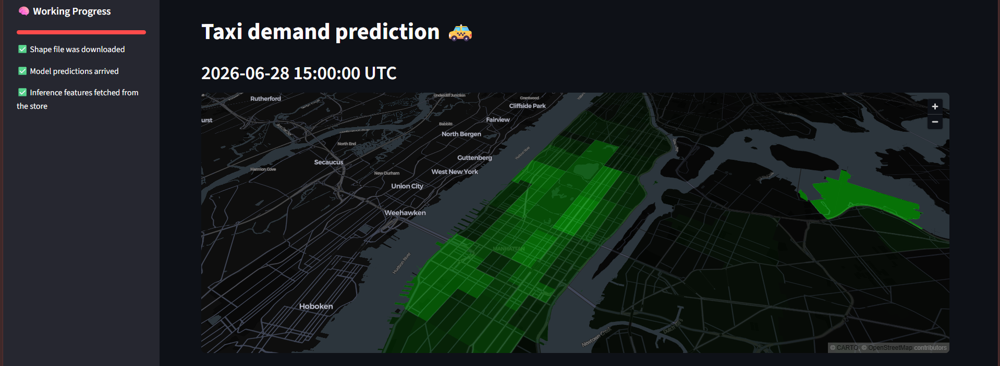
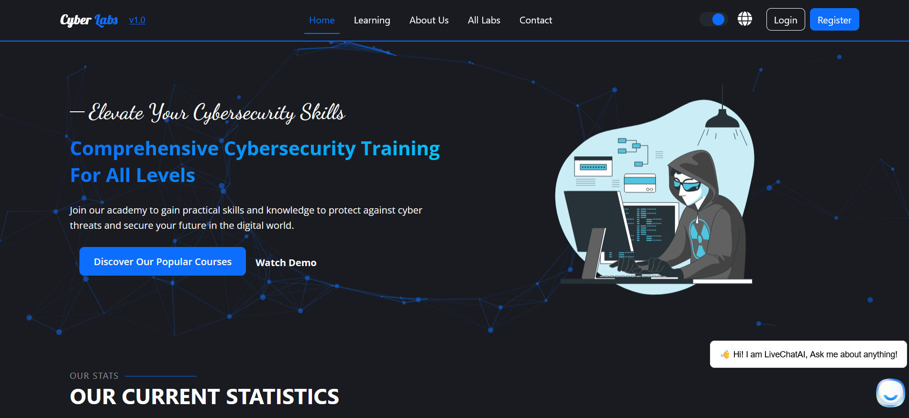

  

  <!-- Social Icons -->
  
  

 

## About Me

  
  > **"Leveraging AI to solve real-world problems and deliver impactful solutions."**
  
  **AI/ML Engineer** | **MLOps** | **Deep Learning** | **NLP & RAG Systems** | **Real-Time ML**
  
<<<<<<< HEAD
  🎓 B.Sc. in Computer Science and Engineering 
=======
  🎓 B.Sc. in Computer Science and Engineering - Egypt  
>>>>>>> fe56946 (adds NYC Taxi Demand Predictor project)
  💼 Experienced in end-to-end ML pipelines, real-time streaming systems, model deployment, and scalable AI systems
    

 

## Tech Stack

  
  ### Programming & Data Science
  
  
  
  
  
  
  
  ### Machine Learning & Deep Learning
  
  
  
  
  
  
  ### MLOps & Deployment
  
  
  
  
  
  
  
  
  
  
  
  
  ### Real-Time & Streaming
  
  
  
  ### AI/NLP & Vector Databases
  
  
  
  
  
  ### Databases & Version Control
  
  
  
  
  
  
  ### Web Development
  
  
  
  

 

## Featured Projects

---

### 🪙 **Real-Time ML System — Crypto Price Predictor**

A production-grade real-time ML system that ingests live crypto market data and news, transforms them into features, and serves price predictions through a microservices architecture.  
Streams trades via the Kraken WebSocket API, aggregates into OHLCV candles, computes technical indicators, extracts news sentiment, and trains & serves models continuously.

**Stack:** Quix Streams · MLflow · Kubernetes · Kafka · Grafana · PostgreSQL · Kind/Civo · Rust · Python  
**Features:** Real-time inference · Model registry · Data validation · Automated monitoring · Dockerized microservices · Dev & prod Kubernetes manifests

---

### 🚕 **NYC Taxi Demand Predictor**

End-to-End ML product that predicts taxi demand across NYC areas, inspired by Uber's airport forecasting system.  
Implements a full batch-scoring MLOps architecture with a feature pipeline (runs hourly via GitHub Actions), a training pipeline with LightGBM and Optuna hyperparameter tuning, and a prediction pipeline serving results through a Streamlit dashboard.  
Historical taxi ride data is transformed into time-series features using sliding windows and stored in a Hopsworks feature store. Includes baseline modeling, feature engineering (geo coordinates, temporal features, demand trends), and CometML experiment tracking.

**Stack:** Python · LightGBM · Scikit-learn · Hopsworks · CometML · GitHub Actions · Streamlit · Optuna  
**Features:** Hourly automated feature ingestion · Feature store · Model registry · Sliding window transforms · Geo & temporal feature engineering · Serverless MLOps

---

### 🏠 **US Housing Price Prediction**
End-to-end ML pipeline with time-aware validation, hyperparameter optimization, and cloud deployment.  
Features MLflow tracking, Docker containerization, and interactive Streamlit dashboard.

---

### 📉 **Telco Customer Churn Prediction**
End-to-end machine learning pipeline for predicting customer churn using advanced feature engineering, Great Expectations data validation, hyperparameter tuning, and full MLOps workflow.

Includes automated training pipeline, MLflow experiment tracking, Dockerized model serving with FastAPI, and CI/CD-ready project structure.

---

### 📚 **RAG Application for Documents**
Intelligent document querying system with AI-powered responses using Retrieval-Augmented Generation.  
Built with FastAPI, PostgreSQL + pgvector, and multiple LLM providers integration.

---

### 🔒 **CyberLab Platform** (Graduation Project)

Web-based cybersecurity training platform with interactive labs simulating real-world scenarios.  
Features containerized labs, role-based access control, and authentication system.

---

 

## GitHub Stats

  

 

---

  <i>"Turning data into intelligence, one model at a time"</i>

